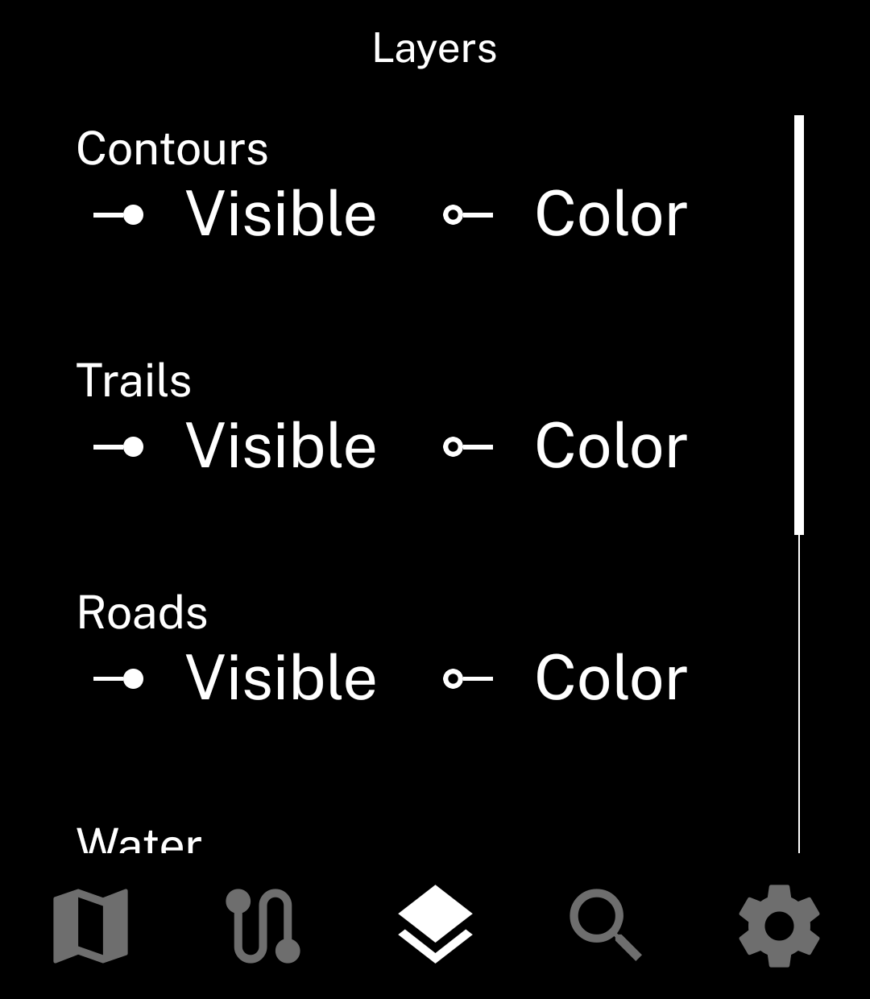
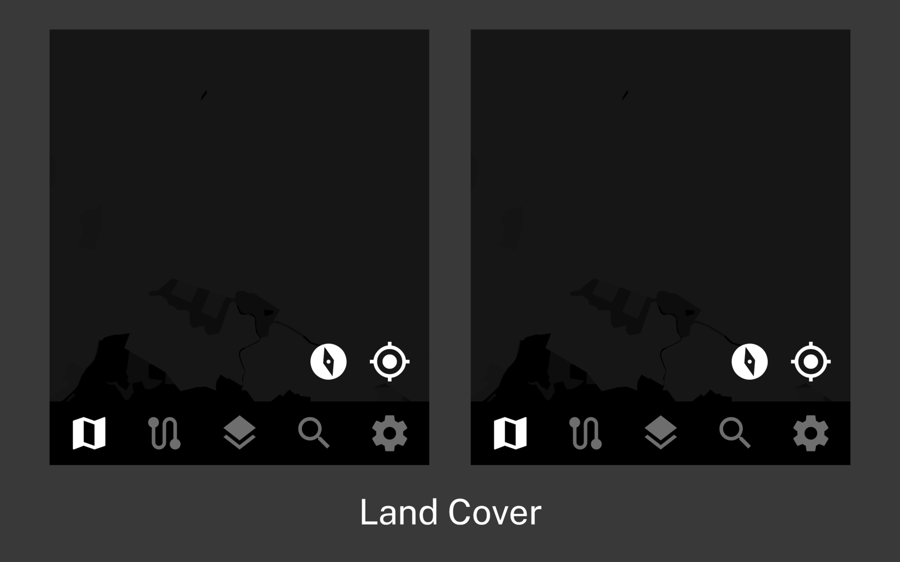
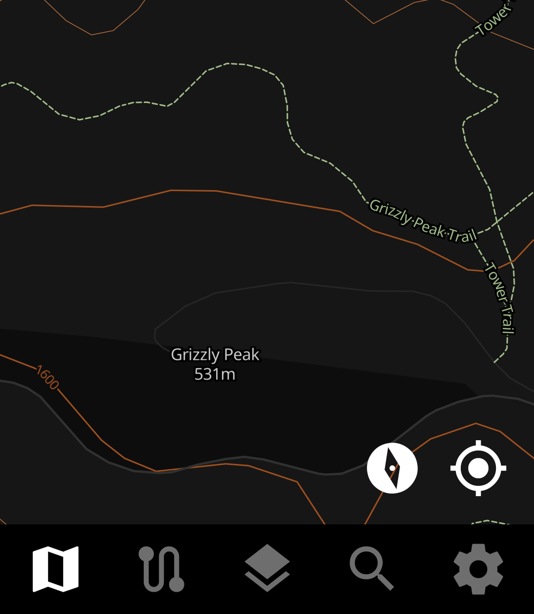
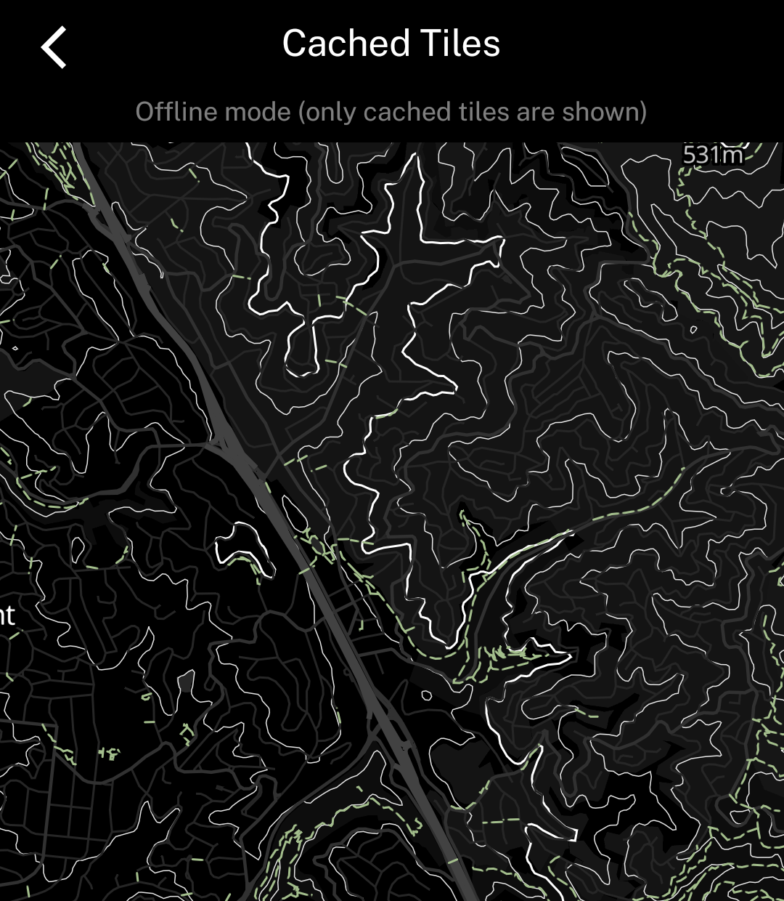

An outdoor maps app for the Light Phone III.

## Features
- Map with layers for trails, roads, topographic contours, waterways, and labels
    - Individual layer visibility and color can be toggled
    - The map is powered by [OpenStreetMap](https://tiles.openstreetmap.us/), who provides it for free. Everyone say thank you OpenStreetMap!
- Display current GPS location with directional indicator
- Load GPX routes for navigation

### Layers with adjustable toggle/color
    

    

    

### Map rotation

### Named trails and labeled elevations

    

### View cached tiles available for offline use

    

The map provider OpenStreetMap does not allow automatic bulk predownloading of map tiles. However, Topographic does cache the tiles that have been downloaded during normal use.

In "Settings > Cached Tiles," this cache can be previewed so you can see what will be available if you are out and lose cell service. If you're missing tiles around your planned route, while you still have service, you can move the map viewport around that area to cache the tiles.

## Known issues

- The Light Phone's magnetometer (compass) is quite sensitive to outside interefence. Anything metal near the Light Phone can cause the directional indicator to lose accuracy. This includes a metal credit card in a DumbWireless case, which I found out after a very confusing debugging session.
