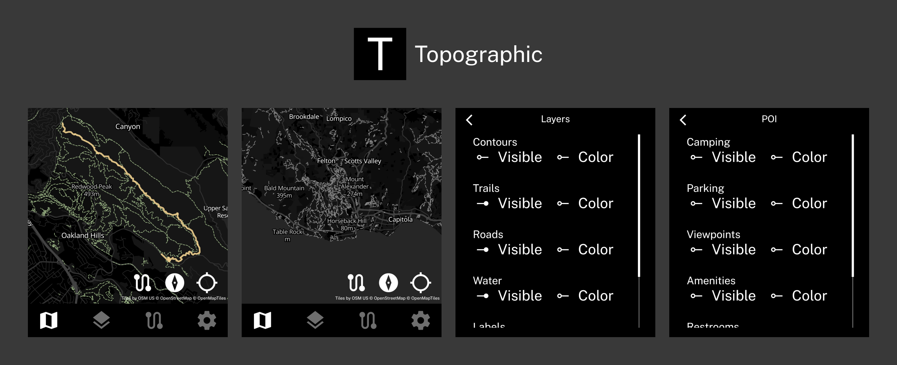
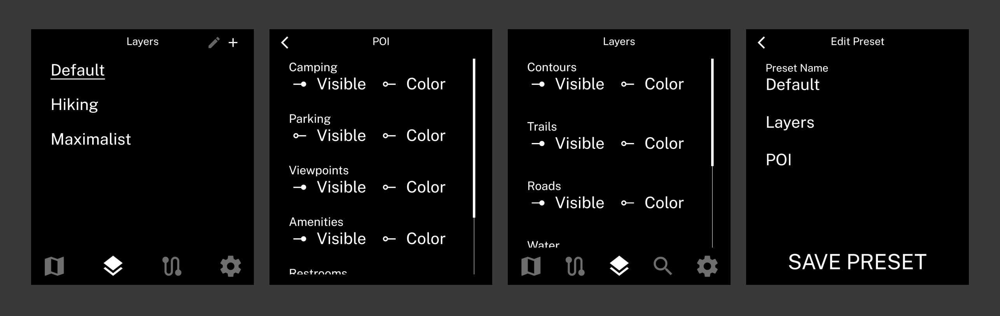
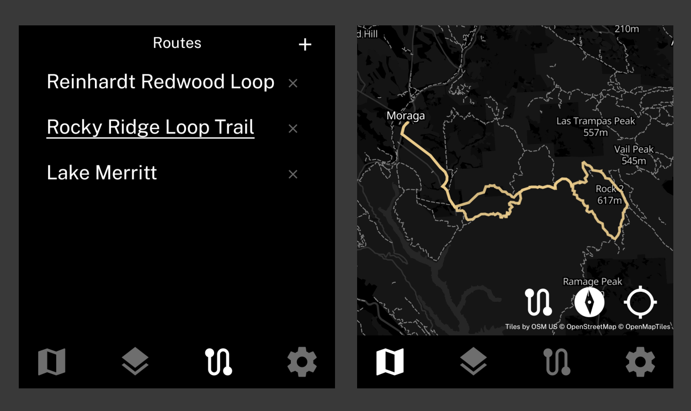
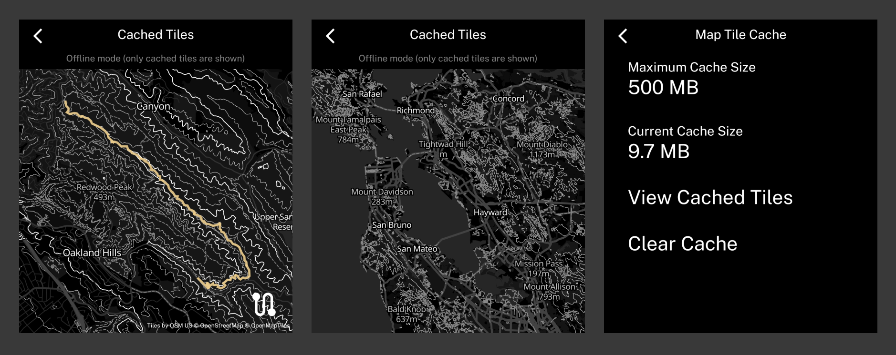

An outdoor maps app for the Light Phone III.

## Features
- Map with layers for trails, roads, topographic contours, waterways, and labels
    - Individual layer/POI visibility and color can be toggled, and settings can be saved as presets
    - The map is powered by [OpenStreetMap](https://tiles.openstreetmap.us/), who provides vector map tiles for free!
- Display current GPS location with directional indicator
- Load GPX routes for navigation

### Layers and POI with adjustable visibility/color
    

### Map utilities

Tap the Compass icon to switch to different map alignment modes: manual, north-up, or heading tracking (rotates the map to match your orientation).

Tap the Target icon to center the map on your current coordinates and toggle auto-center mode.

### GPX routing support

### View cached tiles available for offline use

The map provider OpenStreetMap does not allow automatic bulk predownloading of map tiles. However, Topographic does cache the tiles that have been downloaded during normal use.

In "Settings > Cached Tiles," this cache can be previewed so you can see what will be available if you are out and lose cell service.

## Known issues

The Light Phone's magnetometer (compass) is quite sensitive to outside interefence. Anything metal near the Light Phone can cause the directional indicator to lose accuracy. This includes a metal credit card in a DumbWireless case, which I found out after a very confusing debugging session.

If you encounter any issues, feel free to open an issue!
