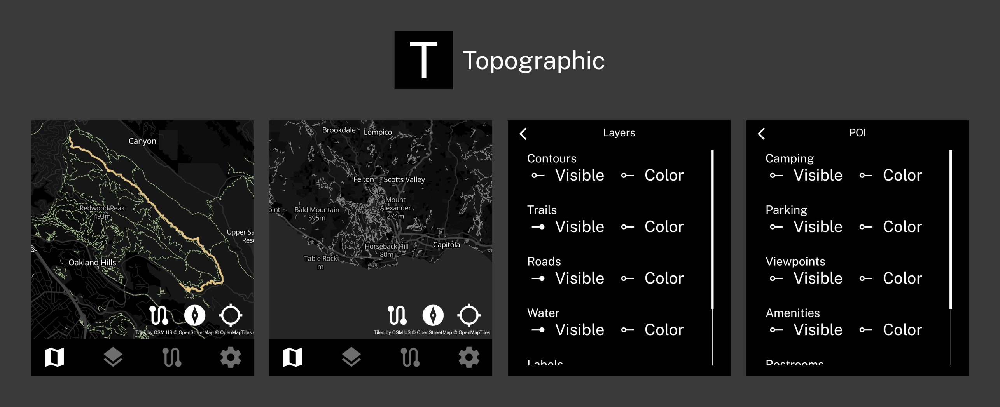
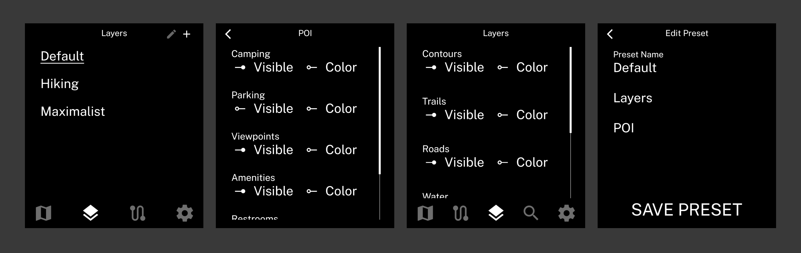
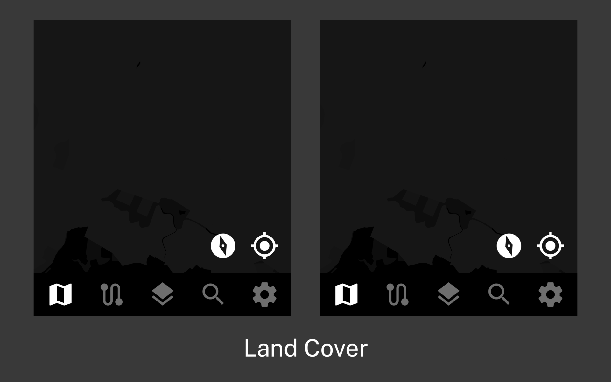
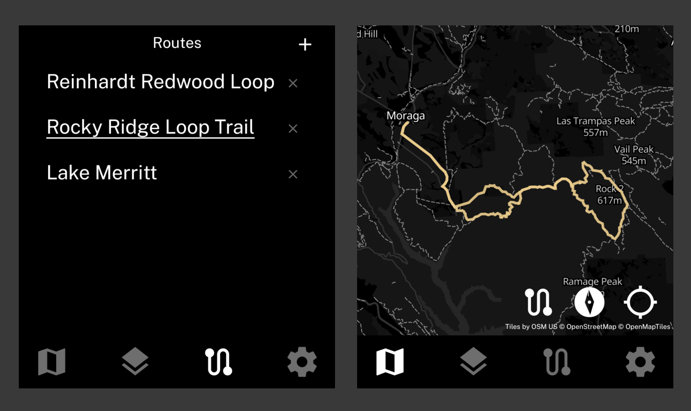
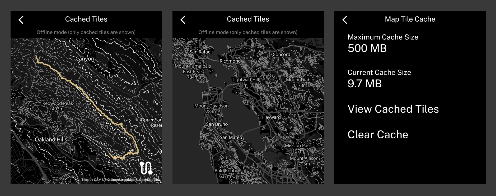

<p>An outdoor maps app for the Light Phone III.</p>

## Features
- Map with layers for trails, roads, topographic contours, waterways, and labels
    - Individual layer/POI visibility and color can be toggled, and settings can be saved as presets
    - The map is powered by [OpenStreetMap](https://tiles.openstreetmap.us/), who provides the map tiles for free!
    - Available in light mode or dark mode, using CartoDB's Positron and Dark Matter base map styles
    - Shows scale bar for gauging distances
    - `adb` support for autotoggling grayscale
- Display current GPS location with directional indicator
    - Supports either continuous polling for GPS location or on-demand fetching GPS location to save battery
    - Shows accuracy radius and time of last GPS location update
- Load GPX routes for navigation
    - Route scrubber to see how far along the trail you are
    - Display waypoints within the GPX file
- Create and edit map markers from the map or by manually inputting coordinates

### Layers and POI with adjustable visibility/color
    




### Map utilities

Tap the Compass icon to switch to different map alignment modes: manual, north-up, or heading tracking (rotates the map to match your orientation).

Tap the Target icon to center the map on your current coordinates and toggle auto-center mode.

### GPX route display



#### Route scrubber

### View cached tiles available for offline use



The map provider OpenStreetMap does not allow automatic bulk predownloading of map tiles. However, Topographic does cache the tiles that have been downloaded during normal use.

In "Settings > Cached Tiles," this cache can be previewed so you can see what will be available if you are out and lose cell service.

### Custom map markers

In the main map view, tap and hold on a position to add a map marker.

Good for remembering campsite locations, where you parked, and so on. Note that Topographic does not support providing navigational directions to map markers.

### Auto-toggle grayscale mode when map opens/closes

Run this command to give Topographic permissions to automatically change the grayscale accessibility setting when a map is open:

```sh
adb shell pm grant com.garado.topographic android.permission.WRITE_SECURE_SETTINGS
```

## Known issues

- The Light Phone's magnetometer (compass) is quite sensitive to outside interference. Anything metal near the Light Phone can cause the directional indicator to lose accuracy. This includes a metal credit card in a DumbWireless case, which I found out after a very confusing debugging session.
